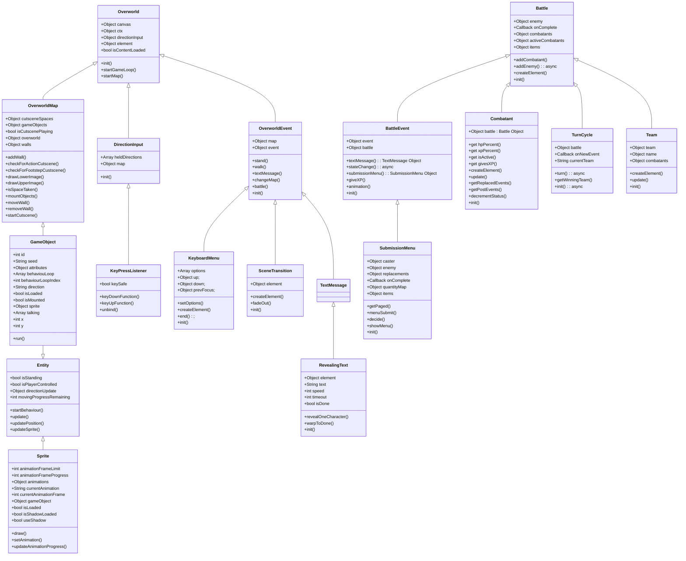

# land-of-zenethians-2d-rpg
A 2d top down RPG made with JavaScript

## To Do's
* Resize canvas based on screen size.
* limit fps so its not determined by screen refresh rate.
* loading screen.
* Random Dungeons with rewards (loot, gold, weapons, xp, etc).
* Make an array of movement behaviours to randomly select when creating an NPC (makes them feel more alive and random).
* Make an array of dialogue options and assign them to NPC's.
* Make an array of quest dialogue options to assign to NPC's.

## Future Ideas
* Random overworld that has dungeon entrances to random generated dungeons.
* Add a Journal that will store the players previous characters, and their journeys. Listing the character back stories and significant events that happened along the way, such as: Dungeons enterd, foes killed, total steps taken, lands visited, npcs met etc.
* Add multiplayer support.
* Add randomised Regions, Towns, Cities, Biomes.
* Add Temperature, Compass, Date?, Month?, Year?, Time?
* Add Minimap with icons on Important locations.
* Add Quest markers.

## Game Structure

### Main Game Objects: UML Diagram
